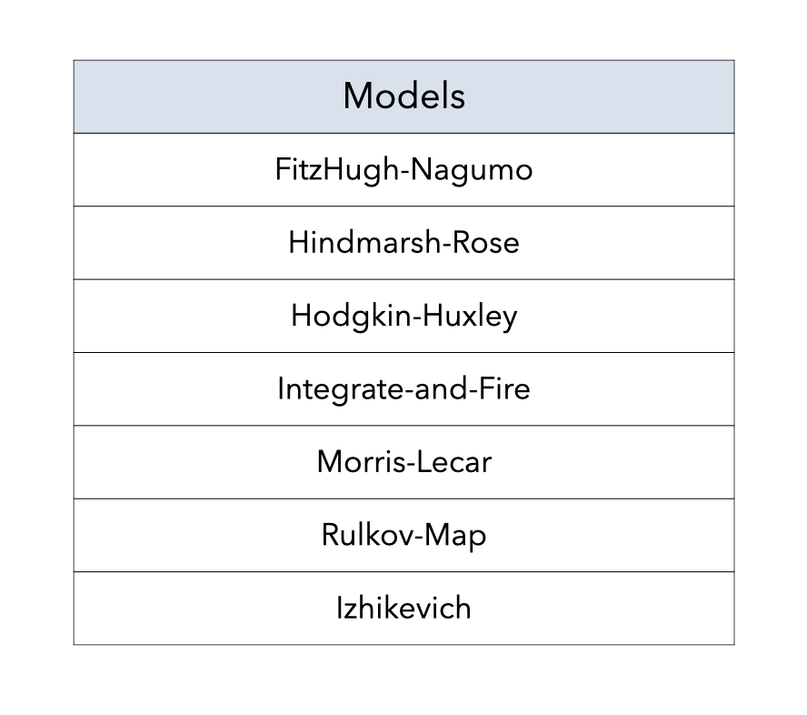

# Biological Neural Models
Collection of  different biological neuron models.

<p align="center">
    
</p>


<p align="center">
    
</p>


## Installation

To install the dependencies, run the following command:

```bash
pip install -r requirements.txt
```


## Usage

Check `notebooks/` to see the details and examples of each model.

