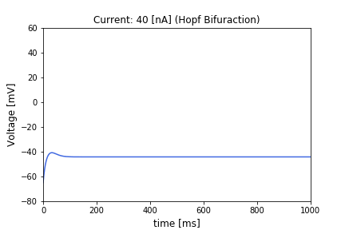

# Biological Neural Models
Collection of  different [biological neuron models](https://en.wikipedia.org/wiki/Biological_neuron_model).

1. [FitzHugh-Nagumo model](https://en.wikipedia.org/wiki/FitzHugh–Nagumo_model)
2. [Hindmarsh-Rose model](https://en.wikipedia.org/wiki/Hindmarsh–Rose_model)
3. [Hodgkin-Huxley model](https://en.wikipedia.org/wiki/Hodgkin–Huxley_model)
4. [Integrate-and-Fire model](https://en.wikipedia.org/wiki/Biological_neuron_model#Leaky_integrate-and-fire)
5. [Morris-Lecar](https://en.wikipedia.org/wiki/Morris–Lecar_model)
6. [Rulkov map](https://en.wikipedia.org/wiki/Rulkov_map)
7. [Izhikevich model](https://www.izhikevich.org/publications/spikes.htm)


<p align="center">
    
</p>


## Installation

To install the dependencies, run the following command:

```bash
pip install -r requirements.txt
```


## Usage

Check `notebooks/` to see the details and examples of each model.

